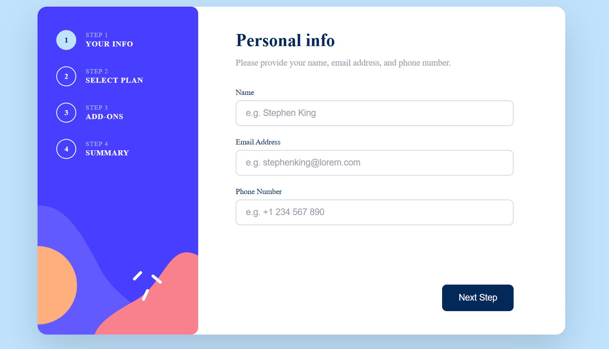

# Frontend Mentor - Multi-step form solution

This is a solution to the [Multi-step form challenge on Frontend Mentor](https://www.frontendmentor.io/challenges/multistep-form-YVAnSdqQBJ).

### The challenge
Users should be able to:

- Complete each step of the sequence
- Go back to a previous step to update their selections
- See a summary of their selections on the final step and confirm their order
- View the optimal layout for the interface depending on their device's screen size
- See hover and focus states for all interactive elements on the page
- Receive form validation messages if:
  - A field has been missed
  - The email address is not formatted correctly
  - A step is submitted but no plan selection has been made

### Screenshot



### Links

- Solution URL: https://github.com/blessingndeks/multi-step-form-main
- Live Site URL: https://game-step-form.netlify.app/

## My process

### Built with

- Semantic HTML5 markup
- CSS custom properties (design token system via `:root` variables)
- Flexbox & CSS Grid
- Vanilla JavaScript (no frameworks or libraries)
- Mobile-first responsive design
- Single-file architecture — HTML, CSS, and JS in one `.html` file

### What I learned
**CSS custom properties as a design token system**
Defining the full color palette in `:root` made it easy to stay consistent and make global changes without hunting through the stylesheet.

```css
:root {
  --Blue950:   hsl(213, 96%, 18%);
  --Purple600: hsl(243, 100%, 62%);
  --Red500:    hsl(354, 84%, 57%);
  /* ... */
}
```

**Embedding SVGs as CSS background-image data URIs**
Rather than relying on external asset paths, the sidebar background illustrations are URL-encoded SVGs set directly as `background-image`. This keeps the project fully self-contained in one file.

```css
.sidebar {
  background-image: url("assets/images/....");
}
```

**State-driven UI without a framework**
Managing step progression, billing toggle, plan selection, and add-on state with a plain JavaScript object taught me to think carefully about the single source of truth before touching the DOM.

```js
const state = {
  currentStep: 1,
  isYearly: false,
  selectedPlan: 'arcade',
  addons: { online: true, storage: true, profile: false }
};
```

**Form validation UX details**
Showing errors inline next to their labels (rather than at the top of the form) and clearing them on `input` rather than on `blur` gives a much more forgiving, less frustrating experience.

### Continued development

- Explore CSS `@starting-style` and `transition-behavior` for smoother panel transitions without JavaScript
- Investigate how this could be rebuilt as a React component with `useReducer` to manage the multi-step state more explicitly
- Add `localStorage` persistence so users don't lose their progress on refresh
- Improve accessibility with a proper ARIA live region that announces step changes to screen readers

### AI Collaboration

This project was built in collaboration with Claude (Anthropic).

- How I used it: Once I had the structure and logic written, I used Claude to help with tedious encoding tasks — specifically URL-encoding the SVG assets for use as CSS background-image data URIs. It also helped me sanity-check a couple of CSS edge cases.

- What worked well: It was a decent time-saver for mechanical tasks I didn't want to do by hand, like escaping special characters in SVG strings.

- What I kept control of: All the architecture, layout decisions, JavaScript logic, and design implementation were my own work. I also had to catch and correct several places where Claude's suggestions didn't match the reference designs — for example, it initially tried to reconstruct the sidebar illustration with CSS shapes instead of using the provided SVG asset.

- Takeaway: Useful for grunt work, but you still need to know exactly what you're building to get anything worthwhile out of it.

---

## Author
- Frontend Mentor — [@blessingndeks](https://www.frontendmentor.io/profile/blessingndeks)
- GitHub — [@blessingndeks](https://github.com/blessingndeks)